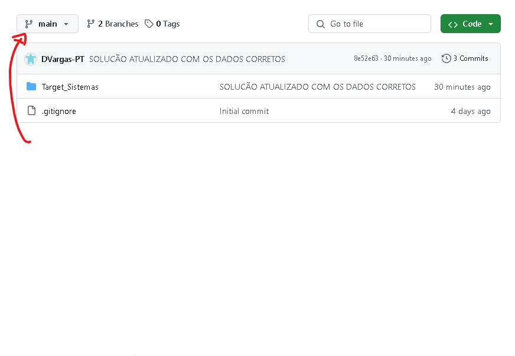
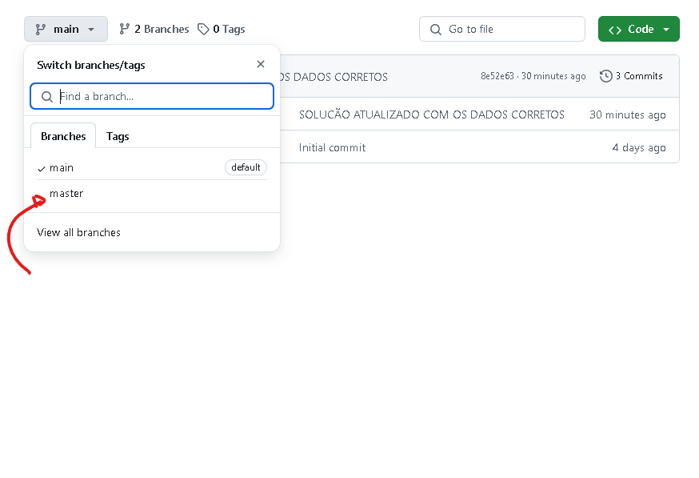
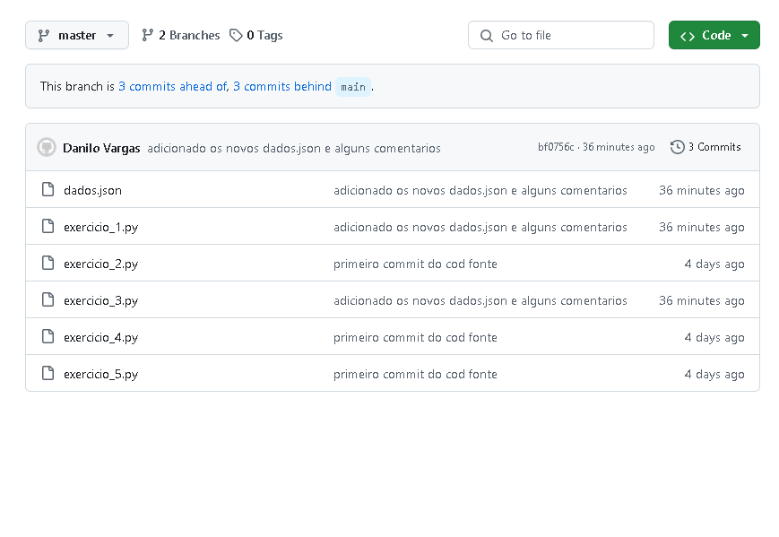

    
    
    

# Exercícios de Python - TargetSistemas 

## Visão Geral
Ola! Este repositorio contem 5 exercicios desenvolvidos em Python utilizando o VSCode. Devido a um erro na plataforma original, tive que utilizar valores ficticios para realizar os exercicios, mas agora estao atualizados com os dados fornecidos.

## Instrucões
Ao abrir o repositorio, siga os passos abaixo para acessar e analisar os exercicios:

1. **Acesse a Branch Correta**:
   - Clique na branch `main` e altere para a branch `master` para acessar os exercicios corrigidos.
   - 

2. **Localize os Exercícios**:
   - Os exercicios podem ser encontrados na branches `master`.
   - 

3. **Correcão e Feedback**:
   - Ao revisar os exercicios, sinta-se a vontade para adicionar comentarios ou anotacões diretamente no codigo.
   - 

## Tecnologias Utilizadas
-  **Python**: Linguagem de programacão utilizada para o desenvolvimento dos exercicios.
-  **VSCode**: Editor de codigo utilizado.

## Observacões
- Caso tenha qualquer duvida ou precise de mais informacões sobre a implementacão dos exercicios, por favor, entre em contato.
- Agradeco pela atencão e pela analise dos exercicios!

## Contato
Se precisar de mais informacões ou tiver alguma duvida, voce pode me contatar atraves de:

- **E-mail**: [danilovargas@alunos.utfpr.edu.br](mailto:danilovargas@alunos.utfpr.edu.br).
- Clicando na foto, voce sera redirecionado para o meu LinkedIn.
  

---

**Nota**: Desculpe a ausencia de cedilhas, o teclado que comprei veio no padrao americano, entao nao possui cecidilha kkkkkkk xD.
